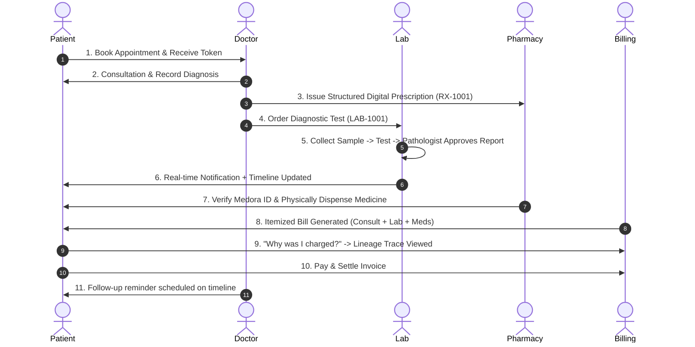

# 🔄 MEDORA — Application Journeys & Flow State Machines

This document specifies the step-by-step state machines for all core healthcare workflows in MEDORA.

---

## 1. Outpatient Journey (Standard Consultation)



---

## 2. Laboratory State Machine

```
[LAB_ORDERED]
      │
      ▼
[SAMPLE_COLLECTED] (Generates Sample Code: SMP-1001)
      │
      ▼
[IN_PROCESSING] (Diagnostic testing & result entry)
      │
      ▼
[PATHOLOGIST_VERIFIED] (Clinical threshold & abnormality check)
      │
      ▼
[REPORT_APPROVED] ──▶ (Auto-emits Notification & Timeline Event)
```

---

## 3. Hospital Pharmacy Dispensing State Machine

```
[PRESCRIPTION_ISSUED] (Doctor commits Rx)
      │
      ▼
[PHARMACY_RECEIVED] (Appears on Pharmacist queue)
      │
      ▼
[MEDICATION_PACKAGED] (Pharmacist flags ready for pickup)
      │
      ▼
[IDENTITY_VERIFIED] (Patient presents Medora ID / Rx ID)
      │
      ▼
[PHYSICALLY_DISPENSED] ──▶ (Dispensation Logged & Added to Patient Timeline)
```

---

## 4. Transparent Billing & "Why Was I Charged?" Lineage

When a patient inspects an invoice item:
```
Example Item: "Complete Blood Count (CBC) — ₹600"
              │
              ├── Doctor Order: Dr. Rajesh Sharma (10:15 AM)
              ├── Department: Central Diagnostic Pathology
              ├── Sample Collected: SMP-1001 (10:30 AM by Lab Staff)
              ├── Approved Report: LAB-1001 (11:45 AM by Dr. Verma)
              ├── Standard Base Rate: ₹600.00
              ├── Insurance Applied: -₹400.00
              └── Net Payable: ₹200.00
```

---

## 5. Emergency & Doctor Unavailable Escalation

```
[EMERGENCY_ARRIVAL] ──▶ Rapid Triage Tag (Red / Yellow / Green)
                             │
                             ▼
                  [CHECK ASSIGNED DOCTOR]
                  ┌──────────┴──────────┐
          [AVAILABLE]             [BUSY / ON CALL / OFF DUTY]
               │                                │
               ▼                                ▼
       [ASSIGN DOCTOR]             [AUTO-SUGGEST AVAILABLE ER DOC]
               │                                │
               └─────────────┬──────────────────┘
                             ▼
               [EMERGENCY SNAPSHOT ACCESSED]
                             │
               [BLOOD / ICU REQUEST DISPATCHED]
```
