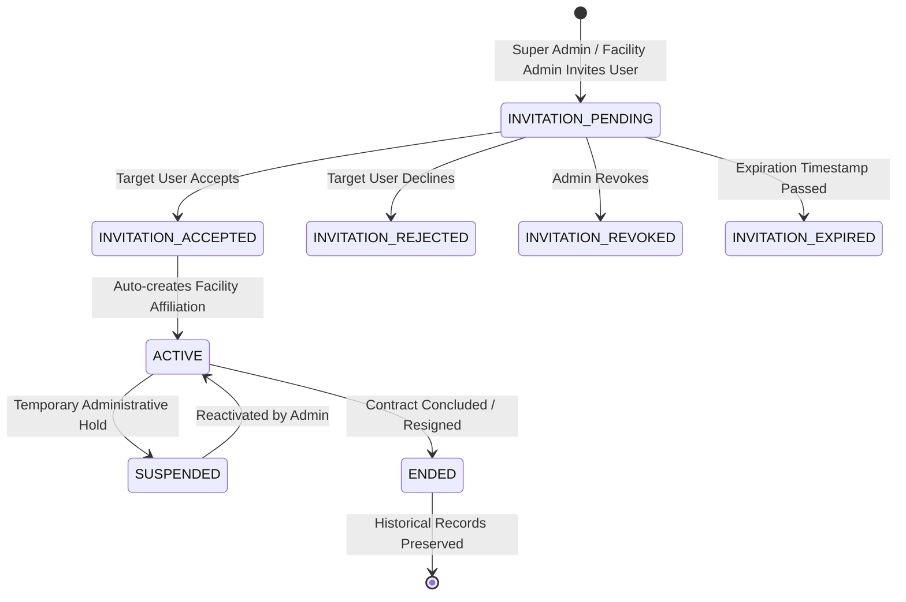

# MEDORA — PHASE 5.3 SPECIFICATION & VERIFICATION
## Healthcare Staff, Doctor Affiliation, Permissions & Operational Assignment Engine

**Current Status:** `VERIFIED & OPERATIONAL`  
**Master Roadmap Phase:** `PHASE 5 — Hospital, Department & Facility Setup`  
**Sub-Phase:** `PHASE 5.3`  
**Previous Active Phases:** `A.1–A.4, B.1–B.4, C.1–C.4, Phase 4, Phase 5.1, Phase 5.2`  
**Next Sub-Phase:** `PHASE 5.4 — Facility Operational Readiness, Connectivity Validation & Phase-6 Integration Contract`  

---

## 1. Executive Summary & Architectural Invariants

Phase 5.3 introduces the authoritative People, Affiliations, Roles, and Least-Privilege Operational Context Engine for the MEDORA ecosystem. It strictly models real-world clinical operations and upholds non-negotiable core invariants:

```
PERSON / HUMAN IDENTITY (e.g. Dr. Ananya Sharma)
  │
  ├── AUTHENTICATED USER IDENTITY (DOC-1001 / doctor@medora.health)
  │     ├── Global Profile & Credentials (MBBS, MD Cardiology, MCI-OD-2015-8821)
  │     │
  │     ├── AFFILIATION 1: City Hospital — Main Campus (FAC-1001)
  │     │     ├── Organization: City Healthcare Group (ORG-1001)
  │     │     ├── Department: Cardiology & Cath Lab (DEP-1001)
  │     │     ├── Role Title: Consultant Cardiologist
  │     │     ├── Status: ACTIVE
  │     │     ├── OPD Room: OPD Room 102
  │     │     ├── Consultation Fee: ₹500
  │     │     └── Schedule Notes: Mon, Wed, Fri (09:00 AM - 01:00 PM)
  │     │
  │     ├── AFFILIATION 2: Green Care Hospital — Cuttack (FAC-1004)
  │     │     ├── Organization: Green Care Healthcare (ORG-1002)
  │     │     ├── Department: Cardiovascular Outpatient Suite (DEP-1010)
  │     │     ├── Role Title: Visiting Specialist
  │     │     ├── Status: ACTIVE
  │     │     ├── OPD Room: Specialist Suite 204
  │     │     ├── Consultation Fee: ₹600
  │     │     └── Schedule Notes: Tue, Thu (02:00 PM - 05:00 PM)
  │     │
  │     └── AFFILIATION 3: Green Care Clinic — Cantonment (FAC-2001)
  │           ├── Organization: Green Care Primary Care Network (ORG-1003)
  │           ├── Department: Visiting Specialty & Cardiology (DEP-2003)
  │           ├── Role Title: Visiting Consultant
  │           ├── Status: ACTIVE
  │           ├── OPD Room: Consultation Room 1
  │           ├── Consultation Fee: ₹500
  │           └── Schedule Notes: Tue, Thu (05:00 PM - 07:00 PM)
```

### Core Invariants Enforced:
1. **One Human = One Authenticated Identity**: A practitioner or staff member holds exactly ONE user account across the entire ecosystem. They do NOT have separate logins (`DOC-1001-A`, `DOC-1001-B`).
2. **Global Identity vs Facility Context**: Global profile stores name, authentication credentials, and medical board registration numbers. Facility affiliation stores organization, facility, department, role title, status, fees, room, and service capabilities.
3. **Department Head Assignment Lifecycle**: Department heads are assigned per department without creating duplicate administrative accounts. Reassigning a department head terminates the previous assignment with `end_date`, preserving chronological audit history and never altering past clinical encounter attributions.
4. **Least-Privilege Role-Based Access Control**: Strict contextual authorization prevents role escalation, cross-organization data access, and unauthorized clinical actions (e.g. receptionists and facility admins cannot create prescriptions; patients cannot manage hospital staff).

---

## 2. Affiliation & Invitation Architecture



---

## 3. Role-Based Access Control (RBAC) Matrix

| Permission Key | PLATFORM_ADMIN | FACILITY_ADMIN | DOCTOR | NURSE | RECEPTIONIST | LAB_STAFF | PATIENT |
|:---|:---:|:---:|:---:|:---:|:---:|:---:|:---:|
| `ORGANIZATION_UPDATE` |  | ❌ | ❌ | ❌ | ❌ | ❌ | ❌ |
| `FACILITY_UPDATE` |  |  | ❌ | ❌ | ❌ | ❌ | ❌ |
| `STAFF_ASSIGN` |  |  | ❌ | ❌ | ❌ | ❌ | ❌ |
| `ENCOUNTER_CREATE` | ❌ | ❌ |  | ❌ | ❌ | ❌ | ❌ |
| `PRESCRIPTION_CREATE` | ❌ | ❌ |  | ❌ | ❌ | ❌ | ❌ |
| `LAB_ORDER_CREATE` | ❌ | ❌ |  | ❌ | ❌ | ❌ | ❌ |
| `LAB_RESULT_ENTER` | ❌ | ❌ | ❌ | ❌ | ❌ |  | ❌ |
| `CHECKIN_PERFORM` | ❌ | ❌ | ❌ |  |  | ❌ |  |
| `TOKEN_GENERATE` | ❌ | ❌ | ❌ | ❌ |  | ❌ | ❌ |
| `APPOINTMENT_CREATE`| ❌ | ❌ | ❌ | ❌ |  | ❌ |  |
| `AUDIT_VIEW` |  |  | ❌ | ❌ | ❌ | ❌ | ❌ |

---

## 4. Verification Results

- **Test Suite**: `scripts/test-phase-5-3-affiliations-permissions.ts`
- **Total Assertions**: 46/46 Passed (100%)
- **TypeScript Compilation**: 0 Errors
