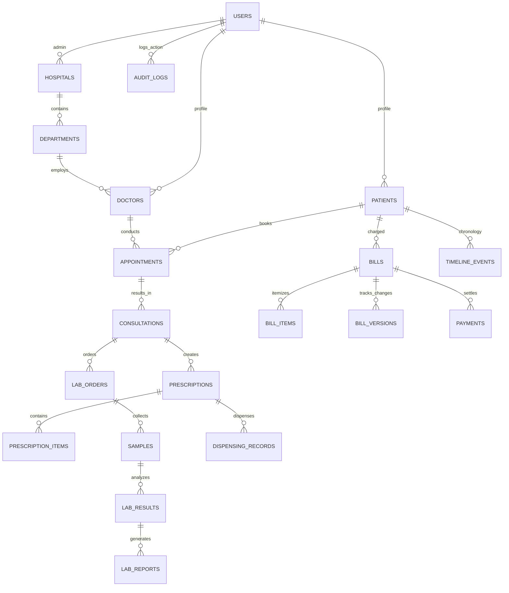

# 🏥 MEDORA — Master Product & Architectural Specification

## 1. Product Identity & Core Mission

**MEDORA** is a connected digital healthcare platform designed to unite all stakeholders in the healthcare ecosystem:
- **Patients & Caregivers**
- **Doctors & Specialists**
- **Hospitals, Clinics & Departments**
- **Diagnostic Laboratories**
- **Hospital Pharmacies**
- **Emergency Medical Teams**
- **Blood Banks & Donors**
- **Insurance & Financial Assistance Providers**

### The Core Paradigm
MEDORA is **NOT** primarily an AI app. AI is secondary and optional.  
The core value is **Connectivity, Transparency, and Traceability across Healthcare Events**.

In MEDORA, medical and financial events are not isolated screens; they form a single traceable chain:
```
Appointment ──▶ Consultation ──▶ Prescription ──▶ Lab Order ──▶ Sample Collection ──▶
Testing ──▶ Report Approval ──▶ Pharmacy Pickup ──▶ Itemized Bill ──▶ "Why Charged?" Lineage ──▶
Audit Log ──▶ Payment & Settlement ──▶ Follow-up Schedule
```

---

## 2. Master System Rules (Non-Negotiable)

1. **Never Break Working Features**: All new features must cleanly integrate with existing tables, services, and routes.
2. **Single-Developer Simplicity**: Avoid microservices or convoluted architectures. Use centralized Next.js (App Router), Supabase (PostgreSQL + Auth + Storage), TypeScript, Tailwind CSS, and shadcn/ui.
3. **No Fake Completions**: If a feature is only frontend UI, mark it `BUILT (UI ONLY)`. If it is mocked for demonstration, label it `SIMULATED / DEMO`. Only mark `VERIFIED` when end-to-end connected and tested.
4. **Append-Only Audit Trail**: Every sensitive action (record access, prescription issue, lab report verification, medication dispensing, bill adjustment, emergency override) creates an immutable audit record:
   $$\text{Audit Record} = \{\text{WHO}, \text{WHAT}, \text{WHEN}, \text{WHY}, \text{STATUS}\}$$
5. **No AI Clinical Decision Making**: AI summaries/explanations are assistive only. AI must never diagnose, prescribe, or triage autonomously.

---

## 3. Supported User Roles & Access Control

| Role Name | Scope & Responsibilities |
| :--- | :--- |
| **`patient`** | Access personal timeline, prescriptions, lab reports, transparent bills, doctor discovery, time-bound sharing. |
| **`doctor`** | View authorized patient history, conduct consultation, generate structured Rx, order lab tests, set follow-ups, refer patients. |
| **`hospital_admin`**| Manage departments, bed allocations, doctor availability, emergency triage, hospital-wide analytics, and audit logs. |
| **`lab_staff`** | Receive lab orders, assign Sample IDs, enter diagnostic values, verify results, issue approved reports. |
| **`pharmacy_staff`**| View incoming digital prescriptions, verify & prepare medication, check Medora ID, log physical dispensing. |
| **`emergency_staff`**| Fast emergency triage intake, check doctor availability, trigger automatic escalation, access Emergency Snapshot. |
| **`blood_staff`** | Receive urgent blood requests, match compatible blood units, coordinate fulfillment. |
| **`finance_staff`** | Manage itemized billing, verify insurance/government scheme split, review patient bill disputes. |
| **`admin`** | Platform configuration, master audit trail, role assignment. |

---

## 4. Master Data Entities & Schema Topology



---

## 5. Primary SIH Hackathon Demo Flow

The ultimate end-to-end showcase demonstrates:
1. **Patient Registration & Discovery**: Patient finds Dr. Sharma at Apex Multispeciality Hospital and books a morning slot.
2. **Clinical Consultation & Structured Rx**: Dr. Sharma records diagnosis, generates a digital prescription with precise timing/meal instructions, and orders a Complete Blood Count (CBC) test.
3. **Lab Workflow**: Diagnostic lab receives the order $\rightarrow$ collects sample (`SMP-1001`) $\rightarrow$ enters test parameters $\rightarrow$ Pathologist approves report $\rightarrow$ patient and doctor get real-time notification.
4. **Hospital Pharmacy Pickup**: Hospital pharmacy sees Rx on their queue $\rightarrow$ packages medicine $\rightarrow$ patient presents Medora ID $\rightarrow$ physical dispense logged $\rightarrow$ medication reminder active on patient app.
5. **Transparent Itemized Billing**: Bill aggregates consultation (₹500) + CBC test (₹600) + medicines (₹450). Patient clicks **"Why was I charged?"** on the CBC item and views the exact order lineage (Doctor order $\rightarrow$ Sample collection $\rightarrow$ Report approval $\rightarrow$ Charge).
6. **Emergency & Escalation**: Simulated trauma arrival $\rightarrow$ assigned doctor busy $\rightarrow$ system suggests available ER specialist $\rightarrow$ urgent O+ blood request created $\rightarrow$ donor match verified.
