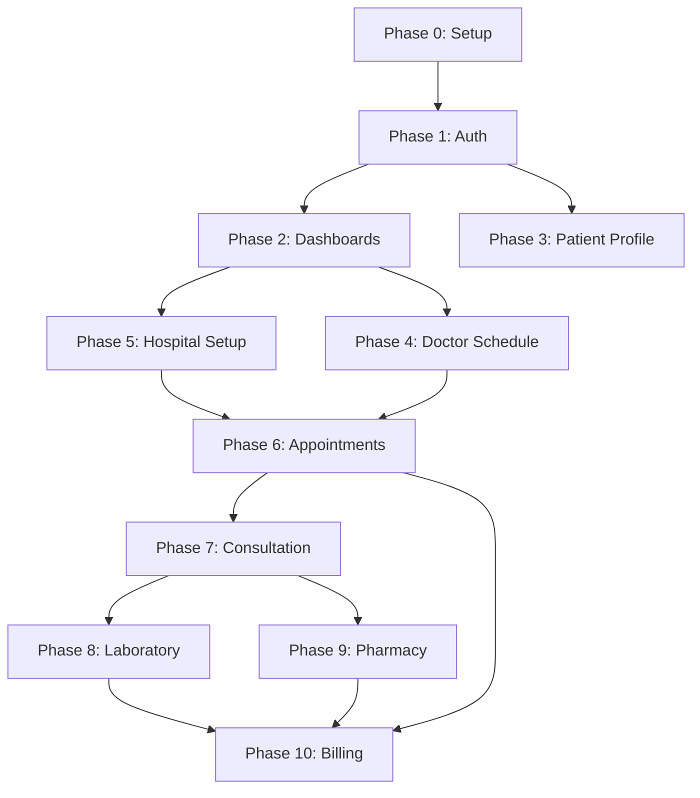

# MEDORA — S1 DEPENDENCY MAP
## Stabilization Track — S1 Document 14 of 15

**Project**: MEDORA — Transparent Connected Healthcare Ecosystem  
**Date**: August 2026  
**Status**: VERIFIED AUDIT

---

## 1. Phase Dependency Chain



---

## 2. Service → Data Store Dependencies

| Service | Depends On (Data Stores) |
|---|---|
| AppointmentBookingService | appointment-store, identity-store, affiliation-store, facility-store, queue-store |
| QueueManagementService | queue-store, appointment-store, encounter-store |
| ConsultationService | encounter-store, clinical-record-store, identity-store |
| PrescriptionOrderService | prescription-store, encounter-store, identity-store, medical-order-store |
| LabOrderService | lab-order-store, encounter-store, identity-store |
| LabSampleService | lab-sample-store, lab-order-store |
| LabTestingService | lab-testing-store, lab-order-store |
| LabReportService | lab-order-store, lab-testing-store, identity-store |
| PharmacyIntakeService | pharmacy-intake-store, prescription-store |
| PharmacyInventoryService | pharmacy-inventory-store, medicine-catalog-store |
| PharmacyFulfillmentService | dispensing-store, pharmacy-order-store, pharmacy-inventory-store |
| BillingEngineService | billing-store, billing-catalog-store, encounter-store |
| PaymentProcessingService | payment-store, billing-store |
| FinancialCoverageService | financial-coverage-store, billing-store |
| FinancialReconciliationService | reconciliation-store, billing-store, payment-store |
| DisputeInvestigationService | dispute-store, billing-store |
| RefundReversalService | payment-store, billing-store |
| OrganizationService | identity-store, affiliation-store, facility-store, department-store, service-store |
| AuthorizationEngine | identity-store, affiliation-store |
| PermissionEngine | identity-store, affiliation-store |
| AccessEngine | relationship-store, affiliation-store |

---

## 3. Cross-Phase Data Flow

### Clinical Flow (Phase 6 → 10)
```
Appointment → Encounter → Consultation → Prescription → Lab Order
     │             │                           │              │
     ▼             ▼                           ▼              ▼
  Queue Token   Clinical Notes         Pharmacy Intake    Lab Intake
     │                                       │              │
     ▼                                       ▼              ▼
  Check-in                            FEFO Stock Check   Sample Collection
                                            │              │
                                            ▼              ▼
                                        Dispensing     Testing → Report
                                            │              │
                                            └──────┬───────┘
                                                   ▼
                                           Bill Generation
                                                   │
                                                   ▼
                                        Coverage Waterfall
                                                   │
                                                   ▼
                                         Payment Processing
                                                   │
                                                   ▼
                                        3-Way Reconciliation
```

### Shared Entity References
- **patient_id**: Referenced by 18 SQL tables and ~25 in-memory stores
- **doctor_id**: Referenced by 8 SQL tables and ~15 stores
- **encounter_id**: Referenced by 6 SQL tables — central pivot entity
- **facility_id**: Referenced by 9 SQL tables
- **organization_id**: Referenced by 12 SQL tables
- **bill_id**: Referenced by 5 SQL tables

---

## 4. Critical Dependency Problems

| ID | Problem | Impact |
|---|---|---|
| DEP-001 | Consultation requires valid encounter_id from appointment check-in or walk-in | Cannot create consultation without encounter flow |
| DEP-002 | Lab order requires encounter_id from active consultation | Cannot order labs without a consultation |
| DEP-003 | Prescription requires encounter_id from active consultation | Cannot create prescription without consultation |
| DEP-004 | Pharmacy intake requires finalized prescription_id | Cannot intake without completed prescription |
| DEP-005 | Billing requires encounter_id or appointment_id | Cannot bill without clinical event |
| DEP-006 | Reconciliation requires both bill_id and payment_id | Cannot reconcile without payment |
| DEP-007 | identity-store is a 65KB monolith shared by ALL services | Single point of failure for identity resolution |
| DEP-008 | All services import from lib/data/* directly — no dependency injection | Tight coupling, hard to test in isolation |

---

## 5. NPM Dependency Analysis

| Package | Purpose | Risk |
|---|---|---|
| next@14.2.24 | Framework | LOW — stable LTS |
| react@18.3.1 | UI | LOW — stable |
| @supabase/ssr@0.5.2 | Auth SDK | LOW — not actively used |
| @supabase/supabase-js@2.49.1 | DB client | LOW — not actively used |
| zod@3.24.2 | Validation | LOW — stable |
| lucide-react@0.475.0 | Icons | LOW — visual only |
| tailwindcss@3.4.17 | Styling | LOW — stable |
| typescript@5.7.3 | Language | LOW — stable |

**No high-risk or deprecated dependencies detected.**
