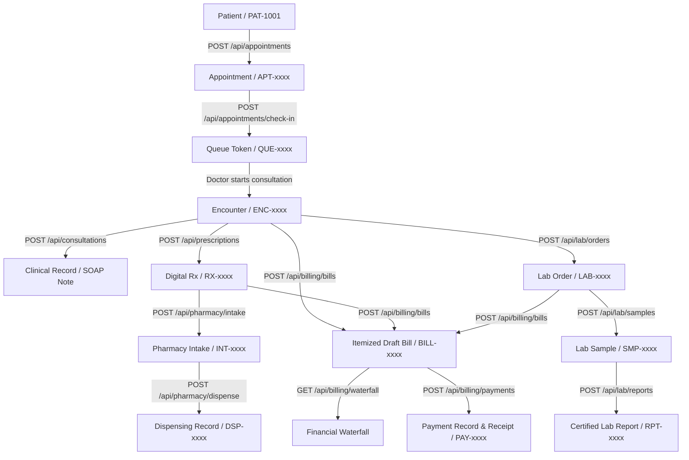

# MEDORA — Stabilization Track S2: End-to-End Data Flow

**Stabilization Phase**: S2  
**Scope**: Connected Healthcare Pipeline & State Persistence (Phases 0–10)

---

## 1. Core End-to-End Healthcare Flow

---

## 2. Step-by-Step Data Flow & Linkage Verification

| Step | Source Entity | ID Reference | API Route Handled | Domain Service Invoked | Target Entity | Status |
|---|---|---|---|---|---|---|
| 1 | Patient | `PAT-1001` | `POST /api/appointments` | `AppointmentBookingService.bookAppointment` | `Appointment (CONFIRMED)` | `VERIFIED` |
| 2 | Appointment | `APT-xxxx` | `POST /api/appointments/check-in` | `QueueManagementService.checkInAppointment` | `QueueEntry (WAITING)` | `VERIFIED` |
| 3 | Queue Token | `QUE-xxxx` | Internal consultation desk | `ConsultationService.startConsultationFromQueue` | `HealthcareEncounter (IN_PROGRESS)` | `VERIFIED` |
| 4 | Encounter | `ENC-xxxx` | `POST /api/consultations` | `ConsultationService.completeConsultation` | `ClinicalRecord (FINALIZED)` | `VERIFIED` |
| 5 | Encounter | `ENC-xxxx` | `POST /api/prescriptions` | `PrescriptionOrderService.issuePrescription` | `HealthcarePrescription (FINALIZED)` | `VERIFIED` |
| 6 | Encounter | `ENC-xxxx` | `POST /api/lab/orders` | `LabOrderService.finalizeLabOrder` | `HealthcareLabOrder (FINALIZED)` | `VERIFIED` |
| 7 | Lab Order | `LAB-xxxx` | `POST /api/lab/samples` | `LabSampleService.collectSample` | `HealthcareLabSample (IN_TRANSIT)` | `VERIFIED` |
| 8 | Lab Sample | `SMP-xxxx` | `POST /api/lab/reports` | `LabReportService.releaseCertifiedReport` | `LabReport (RELEASED)` | `VERIFIED` |
| 9 | Prescription | `RX-xxxx` | `POST /api/pharmacy/intake` | `PharmacyIntakeService.registerPrescriptionIntake` | `PharmacyIntake (VALID)` | `VERIFIED` |
| 10 | Pharmacy Intake | `INT-xxxx` | `POST /api/pharmacy/dispense` | `PharmacyFulfillmentService.dispenseOrder` | `DispensingRecord (COMPLETED)` | `VERIFIED` |
| 11 | Multi-Service | `ENC`, `RX`, `LO` | `POST /api/billing/bills` | `BillingEngineService.createDraftBill` | `HealthcareBill (DRAFT)` | `VERIFIED` |
| 12 | Bill | `BILL-xxxx` | `POST /api/billing/payments` | `PaymentProcessingService.executePaymentAttempt` | `PaymentRecord (SUCCESS)` | `VERIFIED` |

---

## 3. Data Integrity Guarantees

1. **Foreign Key Binding**: All clinical artifacts (`ClinicalRecord`, `Prescription`, `LabOrder`, `Referral`) require a valid `encounter_id` and match the patient profile.
2. **Actor Provenance**: Every write operation records `actor_id`, `actor_name`, and timestamp in the `AuditLedger`.
3. **Idempotency**: Repeated requests with the same idempotency token return identical authoritative records without creating duplicate entries.
