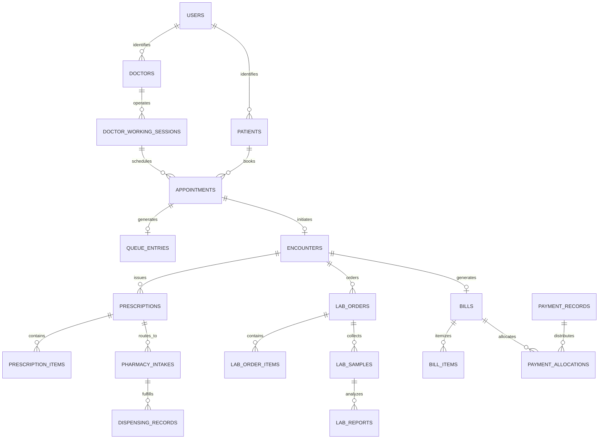

# S3 RELATIONSHIP MAP & FOREIGN KEY CONSTRAINTS

**Project**: MEDORA — Transparent Connected Healthcare Ecosystem  
**Track**: S3 Stabilization Track  
**Focus**: Entity Relationship Mapping across Phase 0–10  

---

## 1. End-to-End Entity Relationship Diagram

---

## 2. Foreign Key Relationship Table

| Parent Entity | Child Entity | Foreign Key Column | Target Primary Key | Cascade Behavior | Business Meaning |
|---|---|---|---|---|---|
| `users` | `patients` | `user_id` | `users.id` | CASCADE | One patient profile per patient user account |
| `users` | `doctors` | `user_id` | `users.id` | CASCADE | One doctor profile per doctor user account |
| `doctors` | `doctor_working_sessions` | `doctor_id` | `doctors.id` | CASCADE | Working shift sessions operated by a doctor |
| `doctor_working_sessions` | `appointments` | `session_id` | `doctor_working_sessions.id` | RESTRICT | Appointment scheduled within a working shift |
| `appointments` | `queue_entries` | `appointment_id` | `appointments.id` | SET NULL | Live queue token assigned upon patient check-in |
| `appointments` | `encounters` | `appointment_id` | `appointments.id` | RESTRICT | Clinical encounter opened for appointment |
| `encounters` | `prescriptions` | `encounter_id` | `encounters.id` | RESTRICT | Digital prescription issued during clinical visit |
| `encounters` | `lab_orders` | `encounter_id` | `encounters.id` | RESTRICT | Diagnostic investigation ordered during visit |
| `lab_orders` | `lab_samples` | `lab_order_id` | `lab_orders.id` | RESTRICT | Physical biological specimen collected for lab order |
| `lab_samples` | `lab_reports` | `sample_id` | `lab_samples.id` | RESTRICT | Diagnostic test report analyzing collected sample |
| `prescriptions` | `dispensing_records`| `prescription_id`| `prescriptions.id` | RESTRICT | Pharmacy medication dispensing against valid prescription |
| `encounters` | `bills` | `encounter_id` | `encounters.id` | SET NULL | Itemized healthcare invoice linked to clinical encounter |
| `bills` | `bill_items` | `bill_id` | `bills.id` | CASCADE | Individual charge items belonging to bill |
| `bills` | `payment_allocations` | `bill_id` | `bills.id` | RESTRICT | Dollar/Rupee allocation of payment against bill |
| `payment_records` | `payment_allocations` | `payment_id` | `payment_records.id` | CASCADE | Allocation lines stemming from payment transaction |
